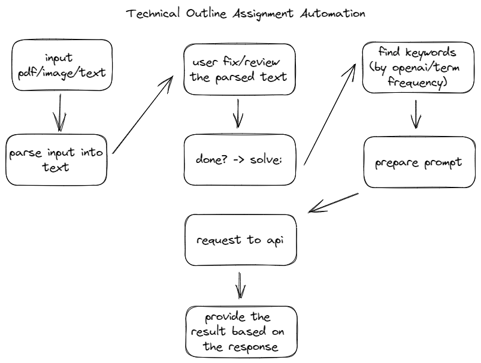
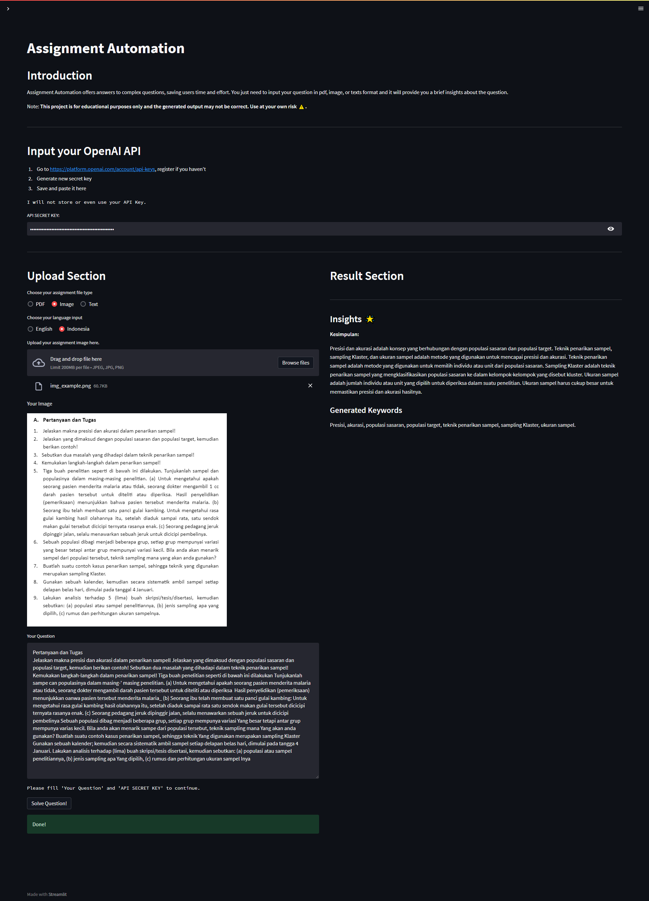
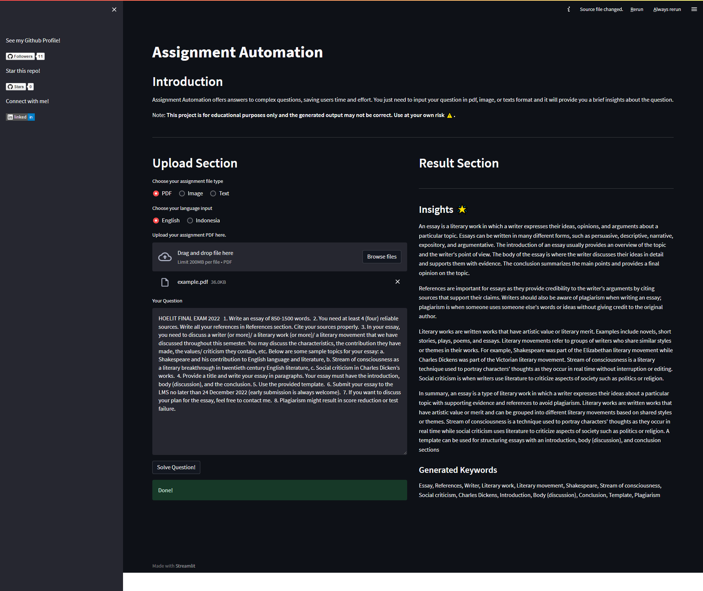

# Assignment Automation

Basically this is a free homework solver.

Assignment Automation is a student project designed to demonstrate the power of AI technology in generating answers and insights. It should not be relied upon for daily use as the results may not always be accurate or complete. This website serves as a learning tool, allowing students and aspiring tech enthusiasts to explore the capabilities of AI and gain a deeper understanding of how it can be used to process information. Whether you're a student or just curious about AI, Assignment Automation provides an exciting opportunity to see the technology in action and discover new possibilities.

You can try it live in [here!](https://assignment-automation.streamlit.app/)

**Note: The generated output may not be correct. Use at your own risk ⚠️.**

## Outline of the program

## Technical Outline

- Use Optical Character Recognition (OCR) software to convert the PDF or image documents into text. (PDF Text-based/Image/Text available)
- Extract the text from the PDF/Image with PyPDF (PDF) / EasyOCR (Image)
- Do text processing on the extracted text
- Process the question with chatgpt api or term frequency to find the keywords
- Request insight with API from the keywords
- Provide an answer in text format from the response

### This project is for education purposes only

I will provide documentation on my journey to solve this project. For those of you who are interested or maybe an expert (know how to solve any problems related to this project), you can open issues in this repo and I will appreciate any of your information.

### You can view my finished progress in [here!](https://sesar-d.notion.site/PROGRESS-PAGE-2bc38597b2c9460b88b7c41cbfab4ecb)

### There are few limits on this project

Maybe you can improve the project by forking, doing pr, or even create your own version.
Here are the limits:
- Unreliable prompt -> the generated output from this project isn't reliable. It's because I designed the prompt to submit as minimum as possible tokens.
- PDF Input -> the pdf input is reliable only if you put the PDF Text-based file type, please refer to my progress for more detailed information about pdf types.
- Limited language -> only available in indonesian and english input.

Another Thoughts:
- You can improve the prompt by making a input types ['exact question', 'insights', 'summarization']
- Or maybe you can design the project to add custom prompt feature

## Example Process and Output

## How to video

https://user-images.githubusercontent.com/75000641/217511104-815c32d9-1460-45d7-b87f-2a4e795aeb32.mp4

