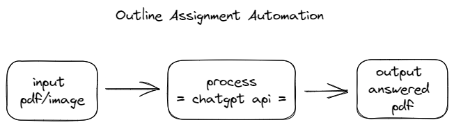

# Assignment Automation

## Outline of the program

## Technical Outline

- Use Optical Character Recognition (OCR) software to convert the PDF or image documents into text. (PDF Text-based only for now)
- Extract the text from the PDF with PyPDF
- Process the question with chatgpt api (if possible)
- Provide an answer in pdf format

### This project is for education purpose only
